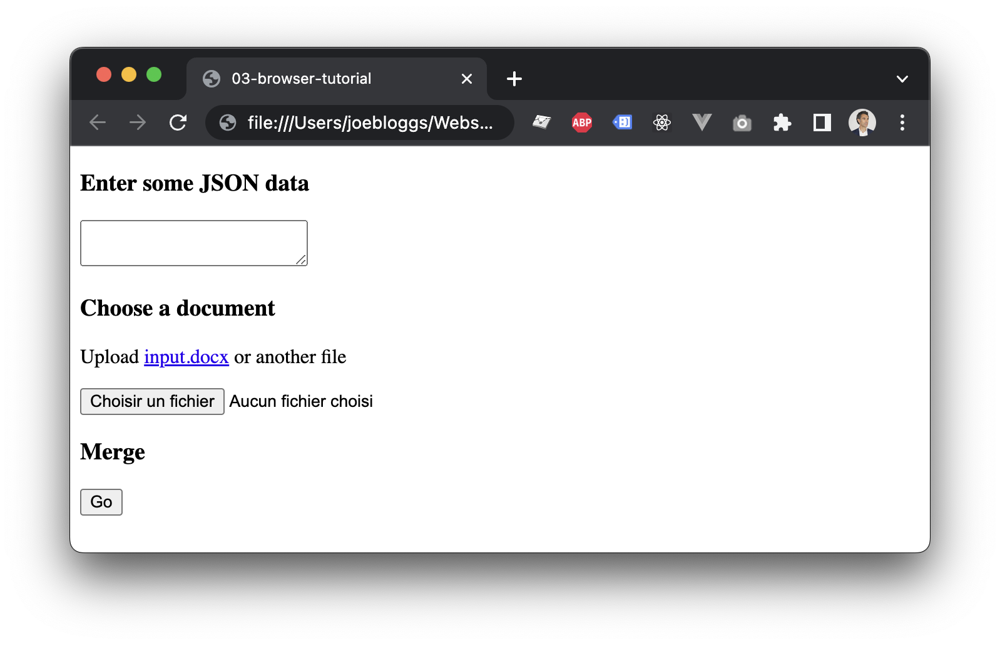

import BrowserWindow from '@site/src/components/BrowserWindow';
import TerminalWindow from '@site/src/components/TerminalWindow';
import WordWindow from '@site/src/components/WordWindow';

# Browser Tutorial

> Automate your Office documents in the browser

:::tip Tip

[Download a Zip of tutorial files](./assets/03-browser-tutorial.zip).

:::

## Prerequisites

Use a modern/recent browser like Google Chrome.

:::tip Tip

You do not need a web server to complete this tutorial, but you may consider [http-server](https://www.npmjs.com/package/http-server).

:::

## Getting started

1) Create a Word document named `input.docx`, type `{{field}}` and save it in the project directory.

<WordWindow title="input.docx">
{'{{field}}'}
</WordWindow>

2) In the same project directory, create a file named `index.html` and copy-paste a basic html skeleton for an empty page:

```html showLineNumbers title=index.html
<!DOCTYPE html>
<html lang="en">
<head>
    <meta charset="UTF-8">
    <title>03-browser-tutorial</title>
</head>
<body>

</body>
</html>
```

3) Add a script reference to @yumdocs/yumdocs in the **head** section:

```html showLineNumbers {6-7} title=index.html
<!DOCTYPE html>
<html lang="en">
<head>
    <meta charset="UTF-8">
    <title>03-browser-tutorial</title>
    <!-- script reference to @yumdocs/yumdocs -->
    <script src="https://unpkg.com/@yumdocs/yumdocs"></script>
</head>
<body>

</body>
</html>
```

4) Add a textarea, a file input and a submit button at the top of the **body** section:

```html showLineNumbers {10-22} title=index.html
<!DOCTYPE html>
<html lang="en">
<head>
    <meta charset="UTF-8">
    <title>03-browser-tutorial</title>
    <!-- script reference to @yumdocs/yumdocs -->
    <script src="https://unpkg.com/@yumdocs/yumdocs"></script>
</head>
<body>
    <!-- textarea for data -->
    <h3>Enter some JSON data</h3>
    <textarea></textarea>
    <p id="message1" style="color:red"></p>
    <!-- file input for office template -->
    <h3>Choose a document</h3>
    <p>Upload <a href="./input.docx">input.docx</a> or another file</p>
    <input type="file" />
    <p id="message2" style="color:red"></p>
    <!-- submit button -->
    <h3>Merge</h3>
    <button>Go</button>
    <p id="message3" style="color:red"></p>
</body>
</html>
```

`index.html` opened in a browser should now look as follows:



5) You now need to add some JavaScript to read the textarea and the file input 
in order to generate a merged document upon clicking the `Go` button:

```html showLineNumbers {23-76} title=index.html
<!DOCTYPE html>
<html lang="en">
<head>
    <meta charset="UTF-8">
    <title>03-browser-tutorial</title>
    <!-- script reference to @yumdocs/yumdocs -->
    <script src="https://unpkg.com/@yumdocs/yumdocs"></script>
</head>
<body>
    <!-- textarea for data -->
    <h3>Enter some JSON data</h3>
    <textarea></textarea>
    <p id="message1" style="color:red"></p>
    <!-- file input for office template -->
    <h3>Choose a document</h3>
    <p>Upload <a href="./input.docx">input.docx</a> or another file</p>
    <input type="file" />
    <p id="message2" style="color:red"></p>
    <!-- submit button -->
    <h3>Merge</h3>
    <button>Go</button>
    <p id="message3" style="color:red"></p>
    <!-- our script -->
    <script>
        const { YumTemplate } = window["@yumdocs/yumdocs"];
        const template = new YumTemplate();
        const textarea = document.getElementsByTagName('textarea')[0];
        const input = document.getElementsByTagName('input')[0];
        const button = document.getElementsByTagName('button')[0];
    
        // data
        let data = { field: "Anything you see fit" };
        textarea.value = JSON.stringify(data);
        textarea.addEventListener('change', evt => {
            const message = document.getElementById('message1');
            try {
                data = JSON.parse(evt.currentTarget.value);
                message.innerHTML = '';
            } catch(err) {
                message.innerHTML = err.message;
            }
        });
    
        // file
        let file;
        input.addEventListener('change', evt => {
            file = evt.currentTarget.files[0];
            const message = document.getElementById('message2');
            template.load(file)
                .then(() => {
                    button.disabled = false;
                    message.innerHTML = '';
                })
                .catch(err => {
                    button.disabled = true;
                    message.innerHTML = err.message;
                });
        });
    
        // merge
        button.disabled = true;
        button.addEventListener('click', evt => {
            const message = document.getElementById('message3');
            template.render(data)
                .then(() => {
                    message.innerHTML = '';
                    template.saveAs('output.docx')
                        .catch(error => {
                            message.innerHTML = error.message;
                        });
                })
                .catch(error => {
                    message.innerHTML = error.message;
                });
        });
    </script>
</body>
</html>
```

6) Reload the page, select `input.docx`, and click the `Go` button to download `output.docx`.
Note the `{{field}}` placeholder has been replaced with `Anything you see fit`.

<WordWindow title="output.docx">
Anything you see fit
</WordWindow>